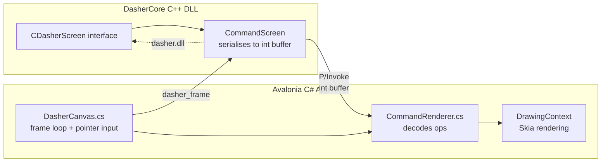

# Dasher for Windows

[](https://github.com/dasher-project/Dasher-Windows/actions/workflows/build-installer.yml)
[](https://github.com/dasher-project/Dasher-Windows/releases)
[](./LICENSE)

Dasher is an information-efficient text-entry interface, driven by continuous
pointing gestures. It lets you write using eye gaze, a mouse, a switch, a
joystick, or touch — designed for accessibility and augmentative communication
(AAC).

This is the **Windows** frontend, built on the shared
[DasherCore](https://github.com/dasher-project/DasherCore) engine.

> **[dasher.at](https://dasher.at)** — downloads, user docs, and live demo
> **[Feature status](https://dasher.at/status/)** — what each platform supports
> **[All repos](https://github.com/dasher-project)** — engine, frontends, design guide

## Status

> **Preview** — actively developed. Download the latest build from
> [Releases](../../releases). See the [feature matrix](https://dasher.at/status/)
> for what's implemented.

## Install

Download the latest MSI or portable ZIP from
[Releases](../../releases). Run the installer or extract and run
`Dasher.Windows.exe`.

## Build

### Prerequisites

- .NET 10 SDK
- CMake 3.20+
- Visual Studio 2026 Community (with C++ desktop development workload, CMake tools, and Windows SDK)
- Git (with submodules)

### Steps

```powershell
git clone --recurse-submodules https://github.com/dasher-project/Dasher-Windows.git
cd Dasher-Windows
```

**1. Build the native DLL** (from a Developer Command Prompt for VS):

```powershell
cd native
.\build.ps1
```

Produces `build/bin/dasher.dll`. Copy it to the app directory:

```powershell
copy .\build\bin\dasher.dll ..\src\Dasher.Windows\
```

**2. Build and run the Avalonia app:**

```powershell
cd ..\src\Dasher.Windows
dotnet run
```

## Architecture

DasherCore is a pure C++ engine. It computes the full zooming tree layout and
renders through an abstract `CDasherScreen` interface. This frontend implements
`CDasherScreen` inside the native DLL (via DasherCore's C API), serialising each
draw call into a flat `int[]` command buffer. C# reads this buffer via P/Invoke
and replays the draw calls into Avalonia's `DrawingContext`.



Each command is 6 ints: `[opcode, a, b, c, d, argb]`

| Op | Meaning | Fields |
|---|---|---|
| 0 | Clear screen | argb = background colour |
| 1 | Circle | a=x, b=y, c=radius, d=1 filled / 0 outline |
| 2 | Line | a=x1, b=y1, c=x2, d=y2 |
| 3 | Rectangle outline | a=x1, b=y1, c=x2, d=y2 |
| 4 | Rectangle filled | a=x1, b=y1, c=x2, d=y2 |
| 5 | Text | a=x, b=y, c=fontSize, d=stringIndex |
| 6 | Set line width | a=width |

See [DasherCore's C API](https://github.com/dasher-project/DasherCore/blob/main/docs/C_API.md) for the engine contract.

## Repository layout

| Path | Purpose |
|---|---|
| `DasherCore/` | DasherCore submodule (do not edit here — PR upstream) |
| `native/` | CMake build glue: builds DasherCore CAPI into `dasher.dll` |
| `src/Dasher.Windows/Engine/` | P/Invoke bridge, command renderer, parameter keys |
| `src/Dasher.Windows/Controls/` | DasherCanvas (frame loop, input), SettingsPanel |
| `src/Dasher.Windows/Views/` | MainWindow (toolbars, canvas, message pane, settings overlay) |
| `src/Dasher.Windows/Services/` | Analytics, migration, speech, update checker |
| `tests/Dasher.Windows.Tests/` | xUnit tests (crash reporting, PII scrubbing) |

## Contributing

See [CONTRIBUTING.md](./CONTRIBUTING.md) for build details, code style, and DCO sign-off. For project-wide conventions (code of conduct, RFCs, security), see the [org contributing guide](https://github.com/dasher-project/.github/blob/main/CONTRIBUTING.md).

## License

MIT — see [LICENSE](https://github.com/dasher-project/.github/blob/main/LICENSE).
